 <h1 align="center">HatBazzar- an ecommerce webapp</h1>

This is HatBazzar - an ecommerce project that is built to help people who are intrested in digital market buying and selling goods online.As most of the businesses are moving rapidly towards the ecommerce ,most of the developers focus is on ecommerce. I am optimistic that this project is going to provide a brief overview of how an e-commerce web works in todays world.

### The project is built With following libraries and frameworks.

* [![Next][Next.js]][Next-url]
* [![Redux][Redux]][Next-url]
* [![Node][Node.js]][Node-url]
* [![Express][Express.js]][Express-url]
* [![MongoDb][MongoDB]][MongoDB-url]

It is a MERN stack project where user retrive data stored in mongodb database.Nextjs is used at the frontend whereas expressjs is used to communicate frontend and backend. Morever it is an open source so you can contribute and provide a pull request to help change and add new functionalities.

The project is supossed to have the following pages inside the app:

- [ ] Register and Login page .
- [ ] Admin dashboard for managing products.
- [ ] Browse through different products(Product description page).
- [ ] Filter products based on category, price and ratings(Filter sideBar/Drawer).
- [ ] Add products to cart(Add product page).
- [ ] View list of all user(User view page).

1) Admin can do the following things in the app:
   *  Add products .
   *  Edit products .
   *  Remove products .
   *  View list of orders .
   *  Remove user/customer .

2) Customer get following features in the app:
   * Homepage/Landing page.
   * Browse through different products.
   * Search for desired product in search bar.
   * Filter products based on Category , Price and rating through stylish drawer.
   * Buy now or add to card feature in the product.

Here are the few screenshots of my project

1) Logo

    

 

2) Sign up page.

    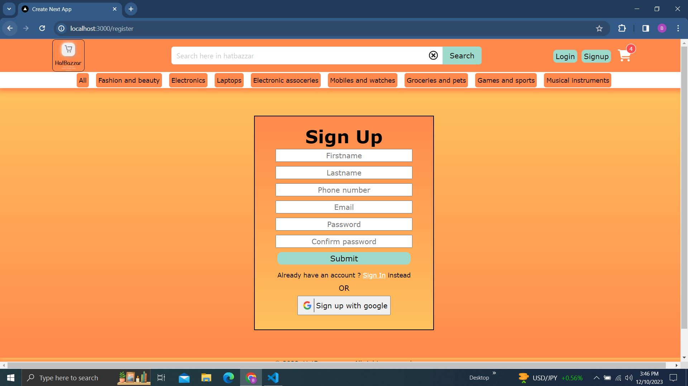

 

3) Login page.

    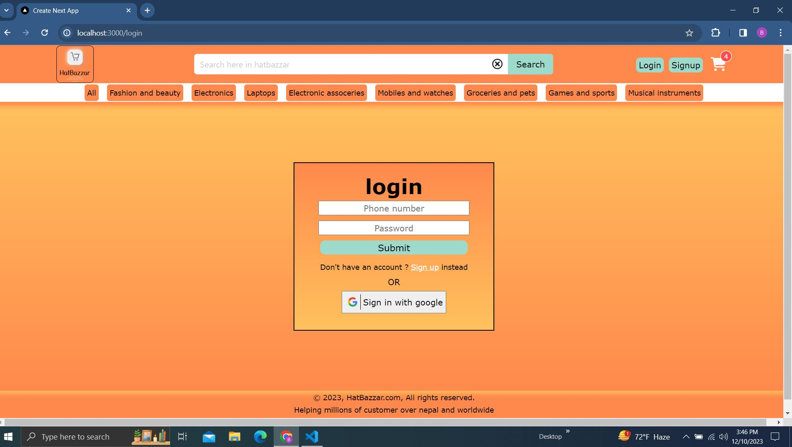

 

4) Homepage.

    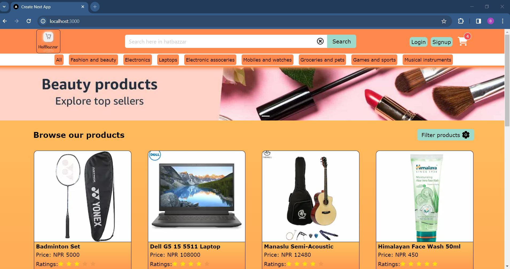

    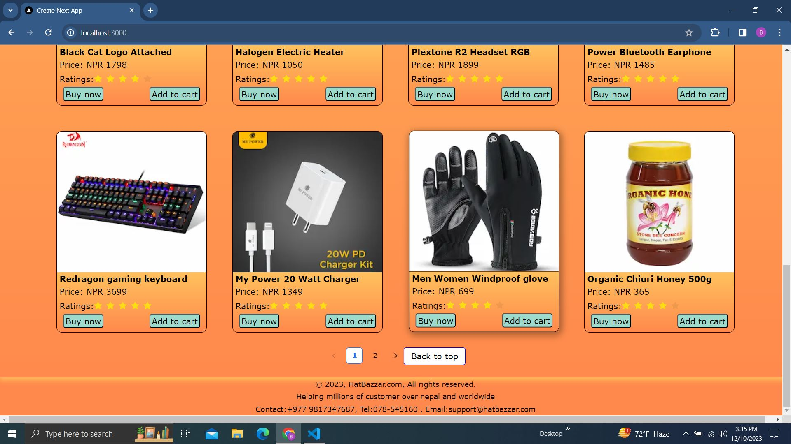

 

5) Description page.

    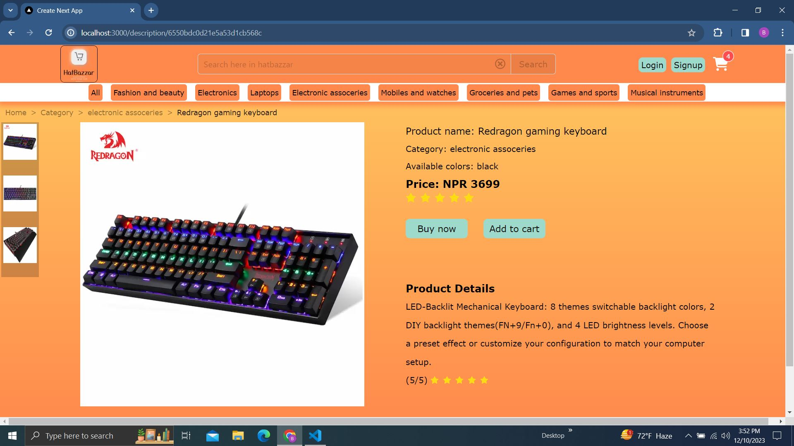

 

6) Filter products.

    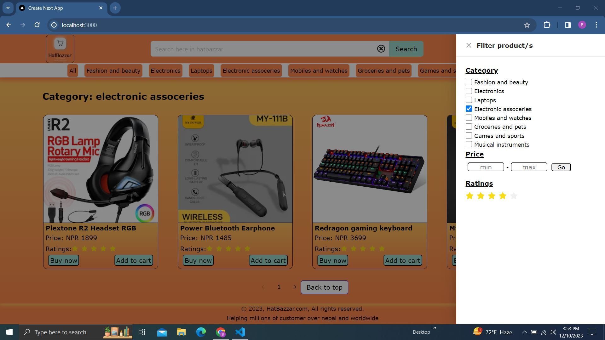

 

7) Search.

    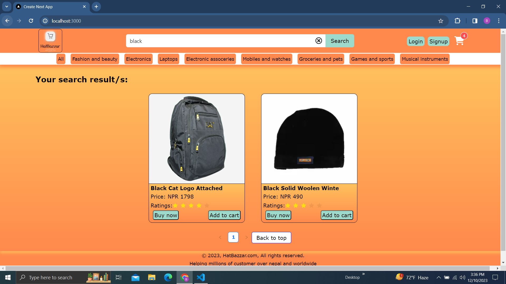

    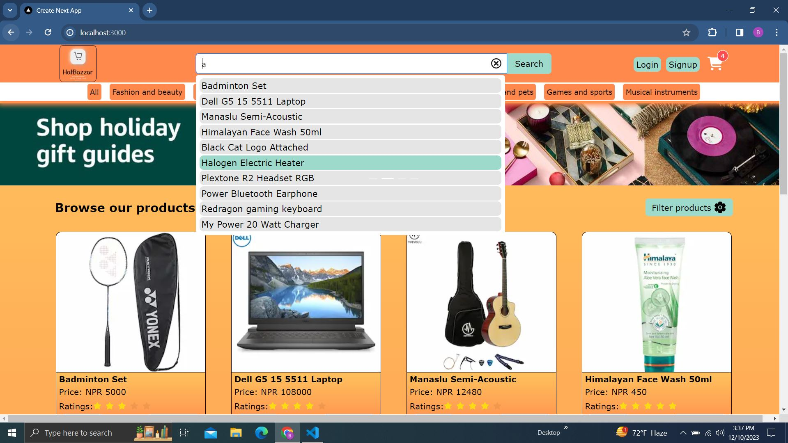

 

8) Category page.

    

 

9) Add product page(admin).

    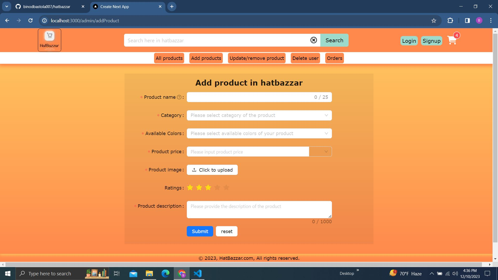

 

10) Edit product page.

    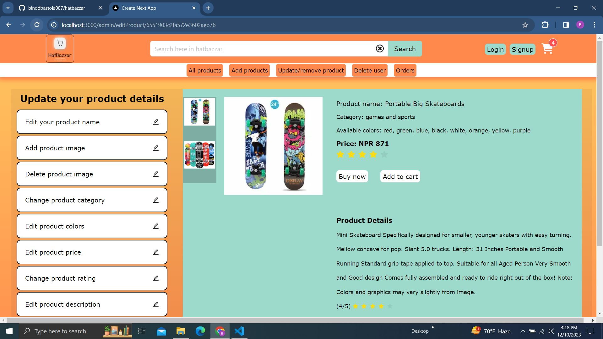

 

11) Remove product page.

    

 

12) Cart page.

    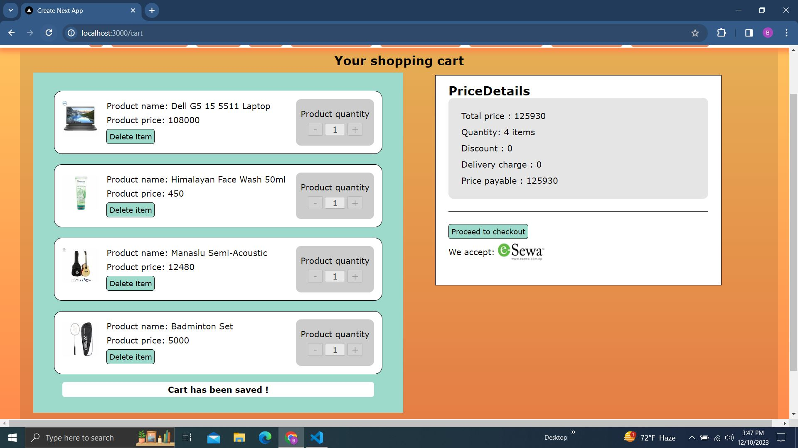

 

13) Checkout page.

    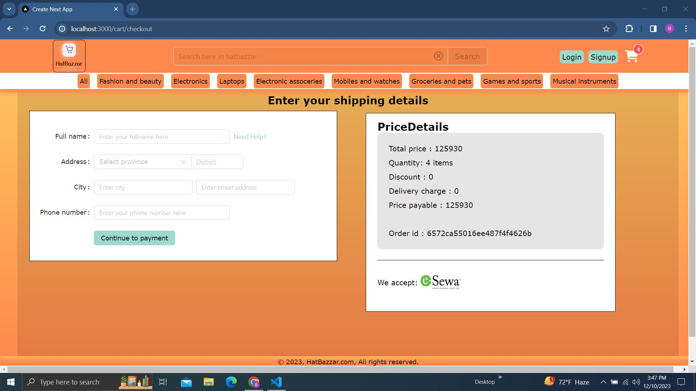

 

<!-- MARKDOWN LINKS & IMAGES -->

[Next.js]: https://img.shields.io/badge/next.js-000000?style=for-the-badge&logo=nextdotjs&logoColor=white
[Next-url]: https://nextjs.org/
[Node.js]: https://img.shields.io/badge/Node.js-43853D?style=for-the-badge&logo=node.js&logoColor=white
[Node-url]: https://nodejs.org/en
[Express.js]:https://img.shields.io/badge/Express.js-404D59?style=for-the-badge
[Express-url]: https://expressjs.com/
[Redux]: https://img.shields.io/badge/Redux-593D88?style=for-the-badge&logo=redux&logoColor=white
[Redux-url]: https://redux.js.org/
[MongoDB]: https://img.shields.io/badge/MongoDB-4EA94B?style=for-the-badge&logo=mongodb&logoColor=white
[MongoDB-url]: https://www.mongodb.com/
